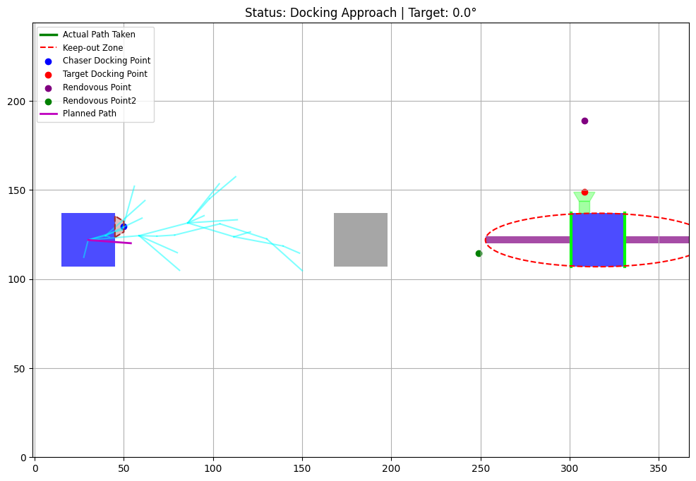
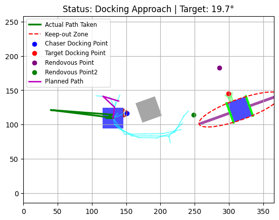
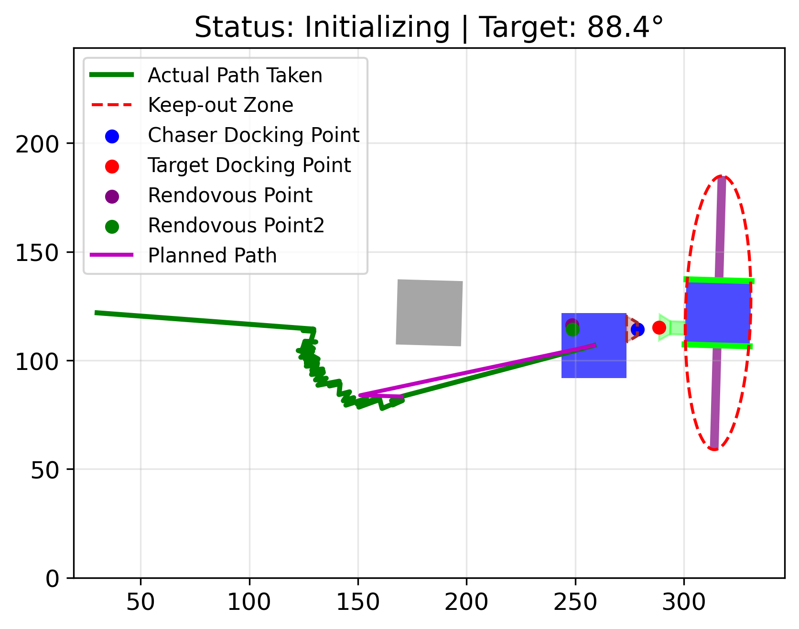

# Autonomous Spacecraft Docking Simulator

This project implements a hybrid control system for spacecraft proximity operations. It uses **RRT*** for global path planning and a **PID Controller** for high-precision docking.

## Features
* **Path Planning**: Adaptive RRT* algorithm with obstacle avoidance.
* **Precision Control**: PID-based translation for docking port alignment.
* **Safety**: Integrated "Keep-out Zone" (KOZ) checking using elliptical bounds.

## How it Works
1. **Initialization**: The Chaser spacecraft identifies the Target's docking cone.
2. **RRT* Phase**: Generates a collision-free path to a "Rendezvous Point."
3. **PID Phase**: Once within range, the PID controller takes over to zero out the position error between docking ports.

## Requirements
* `numpy`
* `matplotlib`
* `pandas`
# Autonomous Spacecraft Docking Simulator

This project implements a hybrid control system for spacecraft proximity operations. It uses **RRT*** for global path planning and a **PID Controller** for high-precision docking.

---

## Simulation Results

### Docking Setup
This plot shows the initial configuration, the static obstacles (grey), and the target spacecraft. The RRT* algorithm is initializing to generate a path to the rendezvous point.

  

### Midway Approach
The chaser (blue box) has calculated a path (purple) to the rendezvous point and is actively traversing it using the PID controller (green actual path). Note how the actual path slightly deviates from the planned path due to simulated noise or control lag.

  

### Docked State
Successful docking achieved. The high-precision PID controller has taken over from the RRT* global planner to zero out the position error between the chaser's docking cone and the target port. The final orientation matches the target's requirements.

  

