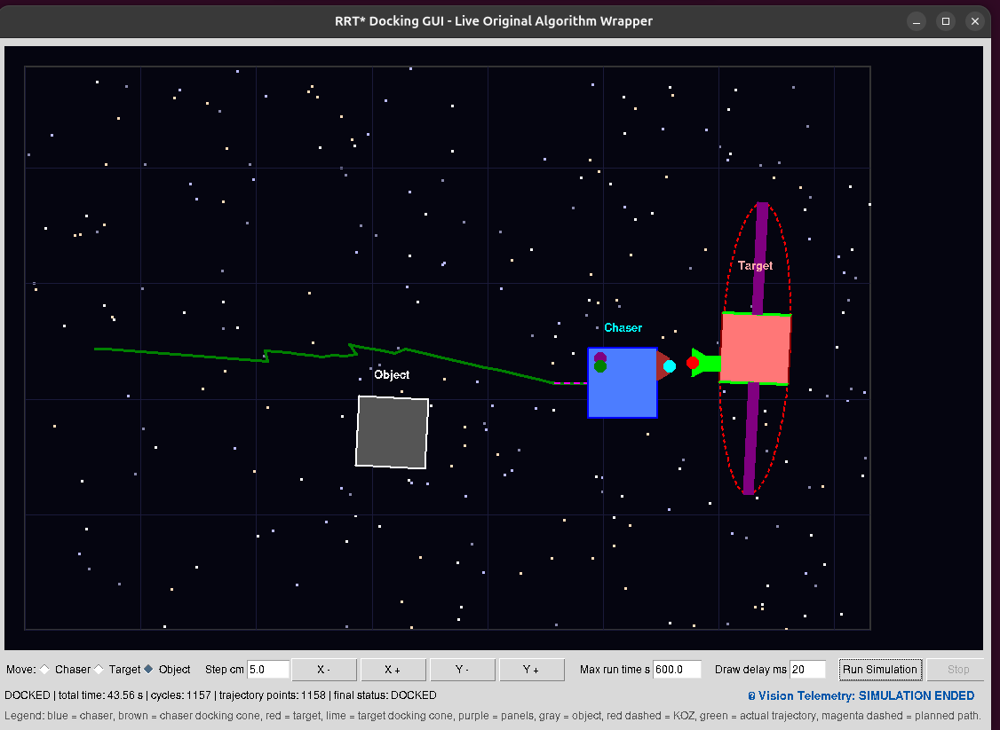

# Autonomous Spacecraft Docking Simulator

A hybrid guidance, navigation, and control (GNC) simulator for spacecraft proximity operations and docking. A chaser spacecraft plans a collision-free path to a target using **RRT\*** with B-spline smoothing, then hands off to a **PID controller** for high-precision final approach and port alignment — all visualized live in an interactive Tkinter GUI.

---

## Features

- **RRT\* Global Planning** — Sampling-based path planning with dynamic step sizing, node rewiring, and static obstacle avoidance.
- **B-Spline Path Smoothing** — Raw RRT* waypoints are refined into a smooth, flyable trajectory before being handed to the controller.
- **Keep-Out Zone (KOZ) Enforcement** — An elliptical exclusion zone around the target is checked during planning so no candidate path clips the target's safety margin.
- **PID Final Approach** — Once within range, a PID controller takes over to drive the chaser's docking cone onto the target's docking point and zero out residual position error.
- **Docking Cone Geometry** — Explicit male/female docking cone modeling for both chaser and target, used to compute docking points and rendezvous points.
- **Live Interactive GUI** — Drag-and-drop chaser, target, and obstacle placement; adjustable step size, run time, and draw delay; live telemetry readout; optional RRT* tree overlay.

## How It Works

1. **Initialization** — The chaser identifies the target's docking cone and rendezvous point, and static obstacles are placed in the world.
2. **RRT\* Phase** — The planner grows a tree outward from the chaser, avoiding obstacles and the target's elliptical KOZ, until it finds a valid path to the rendezvous point.
3. **Smoothing** — The resulting jagged RRT* path is passed through a B-spline smoother to produce a continuous, dynamically reasonable trajectory.
4. **PID Phase** — Within docking range, control switches from the global planner to a PID loop that aligns the chaser's docking point with the target's, converging until the docking tolerance is met.
5. **Docked** — Final orientation and position match the target's docking requirements.

---

## Simulation Results

### Docking Setup
Initial configuration showing the chaser, static obstacles (grey), and the target spacecraft with its elliptical keep-out zone. The RRT* planner is initializing to generate a path to the rendezvous point.

  

### Midway Approach
The chaser (blue box) has found a smoothed path (purple) to the rendezvous point and is actively tracking it under PID control (green = actual path). The actual path deviates slightly from the planned path due to simulated noise and control lag.

  

### Docked State
Successful docking. The PID controller has taken over from the RRT* global planner to zero out the position error between the chaser's docking cone and the target's docking port, with final orientation matching the target's requirements.

  

### Demo Video

  

---

## GUI Legend

`blue` = chaser · `brown` = chaser docking cone · `red` = target · `lime` = target docking cone · `purple` = panels · `gray` = object · `red dashed` = keep-out zone · `green` = actual trajectory · `magenta dashed` = planned path

## Requirements

- `numpy`
- `matplotlib`
- `pandas`
- `tkinter` (standard with most Python installs)
